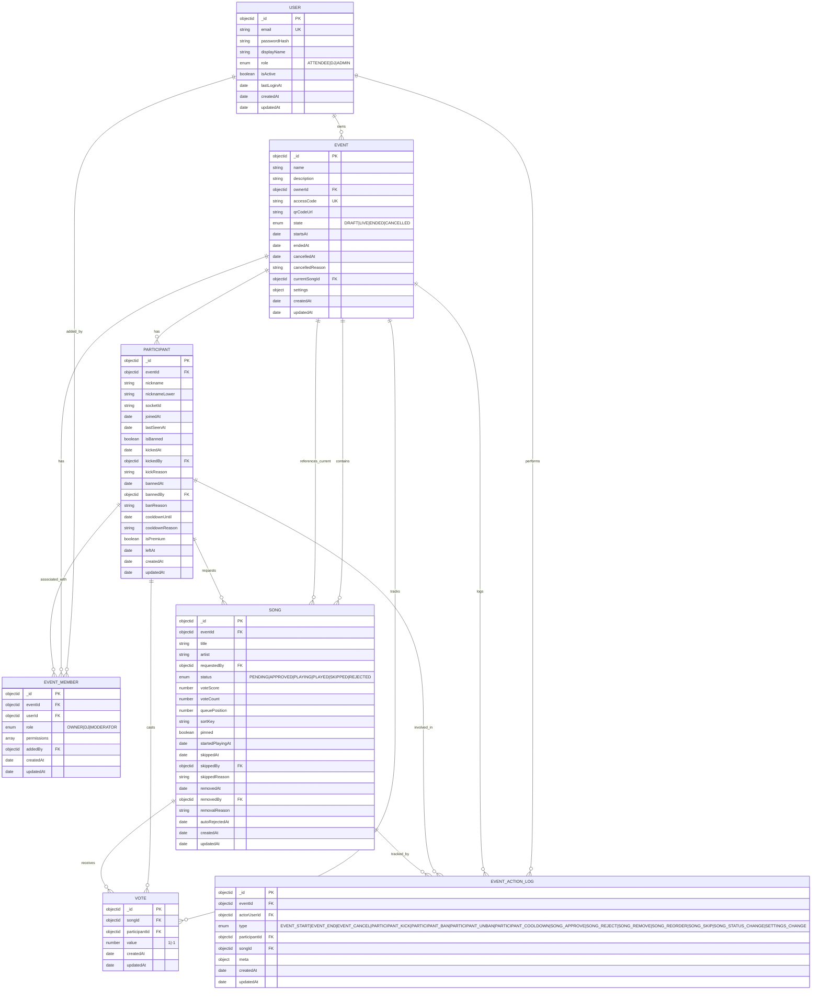

# Servidor Backend SyncRekuest

Node.js + Express REST API con comunicación en tiempo real Socket.IO y persistencia de datos MongoDB.

## Enlaces Rápidos

### 🚀 Inicio Rápido
- **Quick Start**: [QUICK_START.md](QUICK_START.md) - Comienza en 5 minutos
- **Análisis de Ejecución**: [STARTUP_ANALYSIS.md](STARTUP_ANALYSIS.md) - Qué ocurre al ejecutar
- **Checklist de Migración**: [MIGRATION_CHECKLIST.md](MIGRATION_CHECKLIST.md) - Progreso de implementación
- **Guía de Estructura**: [CODE_STRUCTURE_ADAPTATION.md](CODE_STRUCTURE_ADAPTATION.md) - Adaptación a 17-code-structure

### 📚 Documentación del Backend
- **Arquitectura**: [docs-backend/architecture-backend_ES.md](docs-backend/architecture-backend_ES.md)
- **Secuencias**: [docs-backend/sequence-backend_ES.md](docs-backend/sequence-backend_ES.md) (flujos internos del servidor)
- **Esquemas JSON**: [docs-backend/json-backend_ES.md](docs-backend/json-backend_ES.md) (respuestas de API, eventos de socket)
- **Casos de Uso**: [docs-backend/use-cases-backend_ES.md](docs-backend/use-cases-backend_ES.md) (operaciones del servidor)

## Descripción General

Este servidor backend maneja:
- Autenticación de usuarios (registro, inicio de sesión, JWT)
- Gestión de eventos (crear, actualizar, cerrar)
- Cola de sugerencias de canciones (sugerir, aprobar, rechazar, saltar)
- Sistema de votación (emitir voto, ranking, estadísticas)
- Actualizaciones en tiempo real (WebSocket Socket.IO)
- Gestión de participantes (unirse, salir, contar, sistema de cooldown)
- Control de calidad de sugerencias (auto-rechazo de canciones antiguas)
- Sistema de cola con prioridad (participantes premium)
- Historial de reproducción (canciones saltadas, reproducidas)

## Pila Tecnológica

| Capa | Tecnología |
|-------|-----------|
| **Runtime** | Node.js (v18+) |
| **Framework** | Express.js |
| **Base de Datos** | MongoDB |
| **Tiempo Real** | Socket.IO |
| **Autenticación** | JWT |
| **Contraseña** | bcryptjs |
| **Registro** | winston o morgan |

## Estructura del Proyecto

```
src/
├── server.js                  # Punto de entrada
├── config/                    # Configuración
│   ├── database.js
│   ├── environment.js
│   └── socketio.js
├── routes/                    # Puntos finales de API
│   ├── auth.routes.js
│   ├── event.routes.js
│   ├── song.routes.js
│   └── vote.routes.js
├── controllers/               # Manejadores de solicitudes
│   ├── auth.controller.js
│   ├── event.controller.js
│   ├── song.controller.js
│   └── vote.controller.js
├── services/                  # Lógica de negocio
│   ├── auth.service.js
│   ├── event.service.js
│   ├── song.service.js
│   ├── vote.service.js
│   ├── socket.service.js
│   └── notification.service.js
├── repositories/              # Acceso a datos
│   ├── user.repository.js
│   ├── event.repository.js
│   ├── song.repository.js
│   ├── vote.repository.js
│   └── participant.repository.js
├── models/                    # Esquemas de MongoDB
│   ├── User.js
│   ├── Event.js
│   ├── Song.js
│   ├── Vote.js
│   └── Participant.js
├── middleware/                # Middleware de Express
│   ├── auth.middleware.js
│   ├── error.middleware.js
│   ├── logger.middleware.js
│   └── validation.middleware.js
├── socket/                    # Manejadores Socket.IO
│   ├── gateway.js
│   ├── events.js
│   └── handlers.js
└── utils/                     # Utilidades
    ├── jwt.utils.js
    ├── code-generator.js
    ├── qr-generator.js
    ├── validators.js
    └── logger.js
```

## Puntos Finales de API

### Autenticación
```
POST   /api/auth/register      - Registrar nuevo usuario
POST   /api/auth/login         - Iniciar sesión de usuario
POST   /api/auth/refresh       - Actualizar token JWT
GET    /api/auth/me            - Obtener usuario actual
```

### Eventos
```
POST   /api/events             - Crear evento (solo DJ)
GET    /api/events             - Listar eventos activos
GET    /api/events/:eventId    - Obtener detalles del evento
PUT    /api/events/:eventId    - Actualizar evento (solo DJ)
POST   /api/events/:eventId/close - Cerrar evento (solo DJ)
GET    /api/events/:eventId/participants - Obtener participantes
```

### Canciones
```
POST   /api/songs/suggestions  - Sugerir canción
GET    /api/events/:eventId/queue - Obtener cola aprobada
GET    /api/events/:eventId/songs/pending - Obtener pendientes (DJ)
POST   /api/events/:eventId/songs/:songId/approve - Aprobar (DJ)
POST   /api/events/:eventId/songs/:songId/reject - Rechazar (DJ)
POST   /api/events/:eventId/songs/:songId/play - Marcar reproducción (DJ)
POST   /api/events/:eventId/songs/:songId/skip - Saltar canción (DJ)
GET    /api/events/:eventId/songs/:songId/position - Obtener posición en cola
```

### Votos
```
POST   /api/votes              - Emitir voto
DELETE /api/votes/:songId      - Eliminar voto
GET    /api/events/:eventId/votes/stats - Estadísticas de votos
```

## Eventos Socket.IO

### Cliente → Servidor
```
join_event         - Usuario se une al evento
leave_event        - Usuario abandona el evento
```

### Servidor → Cliente
```
votes_updated      - Recuento de votos cambió
song_suggested     - Nueva canción sugerida (DJ)
song_skipped       - Canción saltada por DJ
queue_updated      - Cola reordenada
queue_position     - Posición actualizada en cola
participant_joined - Usuario se unió a evento
participant_left   - Usuario abandonó evento
participant_cooldown - Participante en cooldown
participant_premium - Cambio de estado premium
song_status_changed - Estado de canción actualizado
event_closed       - Evento finalizado
```

## Instalación

**Para una guía rápida, ver: [QUICK_START.md](QUICK_START.md)**

### Requisitos Previos
- Node.js v18+
- MongoDB (local o Atlas)
- npm o yarn

### Configuración Rápida (5 minutos)

```bash
# Clonar repositorio
git clone https://github.com/hpedADAITS/HernanPedraza-PI-Back.git
cd HernanPedraza-PI-Back

# Instalar dependencias
npm install

# El archivo .env ya está configurado
# Personalizar si es necesario:
nano .env

# Iniciar MongoDB (opción A - local)
mongod

# O usar Docker (opción B)
docker run -d -p 27017:27017 --name syncrekuest-mongo mongo:latest

# Servidor de desarrollo (con recarga en caliente)
npm run dev

# El servidor estará disponible en http://localhost:5000
# Probar: curl http://localhost:5000/api/v1/ping
```

### Modo Producción

```bash
# Compilación de producción
npm run build
npm start
```

## Variables de Entorno

```env
# Servidor
PORT=5000
NODE_ENV=development

# Base de Datos
MONGODB_URI=mongodb://localhost:27017/syncrekuest
DB_NAME=syncrekuest

# Autenticación
JWT_SECRET=su-clave-secreta-jwt-super
JWT_EXPIRES_IN=24h

# CORS
FRONTEND_URL=http://localhost:5173
ALLOWED_ORIGINS=http://localhost:5173,http://localhost:3000

# Socket.IO
SOCKET_CORS_ORIGIN=http://localhost:5173

# Registro
LOG_LEVEL=info
LOG_FILE=logs/app.log
```

## Ejecutar el Servidor

### Modo Desarrollo
```bash
npm run dev
```
- Inicia con recarga en caliente
- Registra todas las solicitudes
- Trazos de error completo

### Modo Producción
```bash
npm run build
npm start
```
- Compilación optimizada
- Solo registro de errores
- Rendimiento optimizado

## Pruebas

```bash
# Pruebas unitarias
npm run test:unit

# Pruebas de integración
npm run test:integration

# Pruebas E2E
npm run test:e2e

# Reporte de cobertura
npm run test:coverage
```

## Esquema de Base de Datos

### Diagrama de Entidades (ER Diagram)



- PlantUML: [docs-backend/database-schema.puml](docs-backend/database-schema.puml)
- Mermaid: [docs-backend/database-schema.mmd](docs-backend/database-schema.mmd)

### Colecciones

**users**
```javascript
{
  _id: ObjectId,
  email: String (única),
  password: [REDACTED:password] (hasheada),
  name: String,
  role: String (ATTENDEE | DJ | ADMIN),
  createdAt: Date,
  updatedAt: Date
}
```

**events**
```javascript
{
  _id: ObjectId,
  name: String,
  code: String (única),
  djId: ObjectId,
  status: String (DRAFT | ACTIVE | CLOSED),
  startTime: Date,
  endTime: Date,
  settings: {
    votingEnabled: Boolean,
    maxSuggestionsPerUser: Number
  },
  createdAt: Date,
  updatedAt: Date
}
```

**songs**
```javascript
{
  _id: ObjectId,
  eventId: ObjectId,
  title: String,
  artist: String,
  status: String (PENDING | APPROVED | PLAYING | PLAYED | SKIPPED | REJECTED),
  requestedBy: ObjectId,
  queuePosition: Number,
  voteScore: Number,
  voteCount: Number,
  startedPlayingAt: Date,
  skippedAt: Date,
  skippedBy: ObjectId,
  skippedReason: String,
  autoRejectedAt: Date,
  createdAt: Date,
  updatedAt: Date
}
```

**votes**
```javascript
{
  _id: ObjectId,
  eventId: ObjectId,
  songId: ObjectId,
  userId: ObjectId,
  value: Number (1 | -1),
  createdAt: Date
}
```

**participants**
```javascript
{
  _id: ObjectId,
  eventId: ObjectId,
  nickname: String,
  joinedAt: Date,
  leftAt: Date,
  isBanned: Boolean,
  cooldownUntil: Date,
  cooldownReason: String,
  isPremium: Boolean,
}
```

## Características Avanzadas

### Sistema de Cooldown
Reemplaza el sistema de ban/kick con un sistema de cooldown de 2 horas:
- Los participantes no pueden sugerir canciones durante el cooldown
- Se registra la razón del cooldown
- Automáticamente se levanta después de 2 horas
- Se emite evento `participant_cooldown` en tiempo real

### Cola de Prioridad Premium
Participantes que compran bebidas reciben prioridad en la cola:
- Flag `isPremium` en cada participante
- Las canciones sugeridas por usuarios premium se ordenan con mayor prioridad
- Se emite evento `participant_premium` cuando cambia el estado

### Posición en Cola
Los usuarios pueden ver su posición exacta:
- Campo `queuePosition` en cada canción
- Endpoint para obtener "Your song will play after X songs"
- Se emite evento `queue_position` cuando cambia la posición

### Historial de Reproducción
Seguimiento completo del estado de cada canción:
- `startedPlayingAt` - Marca cuándo comenzó la reproducción
- `skippedAt` - Marca cuándo fue saltada
- `skippedBy` - Usuario que saltó la canción
- `skippedReason` - Razón del skip
- Estado `SKIPPED` para canciones saltadas

### Auto-Rechazo de Sugerencias Antiguas
Control automático de calidad:
- Canciones pendientes por más de 1 día se rechazan automáticamente
- Campo `autoRejectedAt` registra cuándo fue rechazada
- Se emite notificación al sugeridor original
- Evita que la cola se llene de sugerencias obsoletas

### QR Generado por DJ
El DJ genera el código QR al crear el evento:
- QR contiene el código de acceso del evento
- Facilita que los asistentes se unan desde dispositivos móviles
- Se almacena en `qrCodeUrl`

## Seguridad

### Autenticación
- Tokens JWT con expiración de 24 horas
- Hash de contraseña con bcryptjs (10 rondas de salt)
- Validación de token en cada punto final protegido

### Autorización
- Control de acceso basado en roles (ATTENDEE, DJ, ADMIN)
- Verificación de propiedad de DJ para operaciones de eventos
- Verificación de usuario para operaciones de votación

### Base de Datos
- Índices únicos en: email, código de evento
- Relaciones de clave externa mediante ObjectId
- Validación de entrada en todos los campos

### API
- CORS restringido al origen del frontend
- Solo HTTPS en producción
- Rate limiting (opcional, se puede agregar)
- Encabezados de seguridad con helmet.js

## Monitoreo y Registro

### Registros de Aplicación
- Ubicación: `logs/app.log`
- Nivel: configurable (debug, info, warn, error)
- Formato: timestamp, nivel, mensaje, contexto

### Registros de Solicitud
- Método HTTP, ruta, estado, tiempo de respuesta
- Información de usuario (si está autenticado)
- Detalles de error en caso de fallos

### Registros de Base de Datos
- Tiempos de ejecución de consultas
- Estado del grupo de conexiones
- Registro de consultas lentas

## Manejo de Errores

Todos los errores devuelven formato consistente:

```javascript
{
  success: false,
  error: {
    code: "ERROR_CODE",
    message: "Mensaje legible para humanos"
  },
  statusCode: 400
}
```

### Códigos de Estado
- 200: Éxito
- 201: Creado
- 400: Solicitud Incorrecta
- 401: No Autorizado
- 403: Prohibido
- 404: No Encontrado
- 409: Conflicto
- 500: Error del Servidor

## Rendimiento

### Indexación de Base de Datos
- Índices en: email, code, eventId, userId
- Índices compuestos para consultas frecuentes
- Análisis regular de índices

### Almacenamiento en Caché (Opcional)
- Caché de lista de eventos activos
- Caché de cola de eventos por evento
- Invalidar en mutaciones

### Optimización de Consultas
- Usar proyecciones para obtener solo los campos necesarios
- Población selectiva para relaciones
- Paginación para puntos finales de lista

### Optimización Socket.IO
- Usar salas para mensajes específicos del evento
- Protocolo binario para cargas útiles grandes
- Grupo de conexiones

## Despliegue

### Heroku
```bash
# Establecer variables de entorno
heroku config:set JWT_SECRET=su-secreto

# Desplegar
git push heroku main
```

### Docker
```bash
docker build -t syncrekuest-backend .
docker run -p 5000:5000 --env-file .env syncrekuest-backend
```

### AWS / Azure / GCP
- Usar variables de entorno para secretos
- Base de datos: MongoDB administrada (Atlas, CosmosDB, etc.)
- Alojamiento: Lambda, App Service, Cloud Run
- Consulte documentación de despliegue para detalles

## Solución de Problemas

### Problemas de Conexión a MongoDB
```bash
# Verificar cadena de conexión
# Verificar lista blanca de acceso de red
# Pruebe con mongosh
mongosh "mongodb://localhost:27017/syncrekuest"
```

### Errores de Token JWT
```
401 No Autorizado → Token inválido o expirado
403 Prohibido → Usuario carece de permisos
```
- Verificar formato de token en encabezado Authorization
- Verificar que JWT_SECRET coincida con frontend

### Problemas de Conexión Socket.IO
```
WebSocket no se conecta → Verificar SOCKET_CORS_ORIGIN
Tiempo de espera de conexión → Verificar URL de backend desde frontend
```

### Código de Evento No Encontrado
- Asegurar que el código esté en mayúsculas
- Verificar que el estado del evento sea ACTIVE
- Verificar que el código existe en la base de datos

## Contribuyendo

1. Crear rama de características: `git checkout -b feature/su-caracteristica`
2. Realizar cambios siguiendo estilo de código
3. Agregar pruebas para nueva funcionalidad
4. Confirmar: `git commit -m "Agregar descripción de característica"`
5. Enviar: `git push origin feature/su-caracteristica`
6. Crear solicitud de extracción

## Estilo de Código

- Usar sintaxis ES6+
- Seguir patrón async/await (no callbacks)
- Documentar lógica compleja
- Nombrar variables claramente
- Una responsabilidad por función

## Soporte

Para problemas o preguntas:
1. Consulte el archivo de documentación relevante
2. Revise registros de error
3. Verifique conexión a MongoDB
4. Verifique variables de entorno
5. Cree problema en GitHub con detalles del error

## Licencia

Licencia MIT - Consulte archivo LICENSE para detalles

---

## Referencia Rápida

### Iniciar Servidor de Desarrollo
```bash
npm run dev
```

### Ver Registros
```bash
tail -f logs/app.log
```

### Verificar Base de Datos
```bash
mongosh "mongodb://localhost:27017/syncrekuest"
db.events.find()
```

### Probar un Punto Final
```bash
curl -X POST http://localhost:5000/api/auth/login \
  -H "Content-Type: application/json" \
  -d '{"email":"test@example.com","password":"password123"}'
```

### Prueba Socket.IO
Utilizar biblioteca de cliente WebSocket o DevTools del navegador
```javascript
const socket = io('http://localhost:5000', {
  auth: { token: 'su-token-jwt' }
});
socket.emit('join_event', { eventCode: 'ABCD12' });
```

---

**Servidor backend ejecutándose en puerto 5000 por defecto. El frontend se conecta a través de API REST y WebSocket.**
