# Arquitectura Backend - Servidor SyncRekuest

## Diagrama de Arquitectura de Componentes

```plantuml
@startuml
skinparam componentStyle rectangle

package "SyncRekuest Backend (Node.js + Express + MongoDB)" {
  [Punto de Entrada] as EntryPoint
  
  package "Capa de Enrutamiento" {
    [Rutas de Autenticación] as AuthRoutes
    [Rutas de Eventos] as EventRoutes
    [Rutas de Canciones] as SongRoutes
    [Rutas de Votos] as VoteRoutes
  }
  
  package "Middleware" {
    [Middleware de Autenticación JWT] as JWTAuth
    [Manejador de Errores] as ErrorHandler
    [Registrador de Solicitudes] as Logger
    [Middleware de Validación] as Validator
  }
  
  package "Controladores (Lógica de Negocio)" {
    [AuthController] as AuthCtrl
    [EventController] as EventCtrl
    [SongController] as SongCtrl
    [VoteController] as VoteCtrl
  }
  
  package "Servicios (Lógica de Dominio)" {
    [AuthService] as AuthSvc
    [EventService] as EventSvc
    [SongService] as SongSvc
    [VoteService] as VoteSvc
    [SocketService] as SocketSvc
  }
  
  package "Capa de Acceso a Datos" {
    [UserRepository] as UserRepo
    [EventRepository] as EventRepo
    [SongRepository] as SongRepo
    [VoteRepository] as VoteRepo
    [ParticipantRepository] as ParticipantRepo
  }
  
  package "Modelos de Base de Datos" {
    [Modelo de Usuario] as UserModel
    [Modelo de Evento] as EventModel
    [Modelo de Canción] as SongModel
    [Modelo de Voto] as VoteModel
    [Modelo de Participante] as ParticipantModel
  }
  
  package "Capa en Tiempo Real" {
    [Puerta de Socket.IO] as SocketGateway
    [Emisor de Eventos] as EventEmitter
    [Manejador de Eventos de Socket] as SocketHandler
  }
  
  package "Utilidades" {
    [Utilidades JWT] as JWTUtil
    [Generador de Código] as CodeGen
    [Generador de QR] as QRGen
    [Validadores] as ValidatorUtil
    [Registrador] as LoggerUtil
  }
  
  EntryPoint --> AuthRoutes
  EntryPoint --> EventRoutes
  EntryPoint --> SongRoutes
  EntryPoint --> VoteRoutes
  
  AuthRoutes --> JWTAuth
  EventRoutes --> JWTAuth
  SongRoutes --> JWTAuth
  VoteRoutes --> JWTAuth
  
  AuthRoutes --> AuthCtrl
  EventRoutes --> EventCtrl
  SongRoutes --> SongCtrl
  VoteRoutes --> VoteCtrl
  
  AuthCtrl --> AuthSvc
  EventCtrl --> EventSvc
  SongCtrl --> SongSvc
  VoteCtrl --> VoteSvc
  
  AuthSvc --> UserRepo
  EventSvc --> EventRepo
  EventSvc --> ParticipantRepo
  SongSvc --> SongRepo
  VoteSvc --> VoteRepo
  
  UserRepo --> UserModel
  EventRepo --> EventModel
  SongRepo --> SongModel
  VoteRepo --> VoteModel
  ParticipantRepo --> ParticipantModel
  
  SocketGateway --> SocketHandler
  SocketHandler --> EventEmitter
  
  AuthSvc --> JWTUtil
  EventSvc --> CodeGen
  EventSvc --> QRGen
  ValidatorUtil --> Validator
  
  AuthCtrl --> ErrorHandler
  EventCtrl --> ErrorHandler
  SongCtrl --> ErrorHandler
  VoteCtrl --> ErrorHandler
  
  SongSvc --> SocketSvc
  VoteSvc --> SocketSvc
  EventSvc --> SocketSvc
  SocketSvc --> SocketGateway
}

package "Servicios Externos" {
  [MongoDB] <<database>>
  [Biblioteca JWT] <<library>>
  [Socket.IO] <<library>>
}

UserModel --> MongoDB
EventModel --> MongoDB
SongModel --> MongoDB
VoteModel --> MongoDB
ParticipantModel --> MongoDB

@enduml
```




---

## Estructura de Carpetas

```
backend/
├── src/
│   ├── server.js                  # Punto de entrada
│   ├── config/
│   │   ├── database.js            # Conexión a MongoDB
│   │   ├── environment.js         # Variables .env
│   │   └── socketio.js            # Configuración de Socket.IO
│   │
│   ├── routes/
│   │   ├── auth.routes.js
│   │   ├── event.routes.js
│   │   ├── song.routes.js
│   │   └── vote.routes.js
│   │
│   ├── controllers/
│   │   ├── auth.controller.js
│   │   ├── event.controller.js
│   │   ├── song.controller.js
│   │   └── vote.controller.js
│   │
│   ├── services/
│   │   ├── auth.service.js
│   │   ├── event.service.js
│   │   ├── song.service.js
│   │   ├── vote.service.js
│   │   ├── socket.service.js
│   │   └── notification.service.js
│   │
│   ├── repositories/
│   │   ├── user.repository.js
│   │   ├── event.repository.js
│   │   ├── song.repository.js
│   │   ├── vote.repository.js
│   │   └── participant.repository.js
│   │
│   ├── models/
│   │   ├── User.js
│   │   ├── Event.js
│   │   ├── Song.js
│   │   ├── Vote.js
│   │   └── Participant.js
│   │
│   ├── middleware/
│   │   ├── auth.middleware.js
│   │   ├── error.middleware.js
│   │   ├── logger.middleware.js
│   │   └── validation.middleware.js
│   │
│   ├── socket/
│   │   ├── gateway.js
│   │   ├── events.js
│   │   └── handlers.js
│   │
│   └── utils/
│       ├── jwt.utils.js
│       ├── code-generator.js
│       ├── qr-generator.js
│       ├── validators.js
│       └── logger.js
│
├── tests/
│   ├── unit/
│   ├── integration/
│   └── e2e/
│
├── .env.example
├── package.json
└── README.md
```

---

## Capa de Datos (Repositorios)

### Repositorio de Usuario
```javascript
// Métodos:
- create(userData)              // Registrar nuevo usuario
- findByEmail(email)            // Autenticar usuario
- findById(id)                  // Obtener usuario por ID
- update(id, userData)          // Actualizar perfil
- delete(id)                    // Eliminar cuenta
- findAll()                     // Listar usuarios (admin)
```

### Repositorio de Eventos
```javascript
// Métodos:
- create(eventData)             // Crear evento
- findById(id)                  // Obtener detalles del evento
- findByCode(code)              // Unirse a evento por código
- update(id, eventData)         // Actualizar evento
- findActive()                  // Listar eventos activos
- findByDJ(djId)                // Obtener eventos del DJ
- close(id)                     // Marcar como CLOSED
```

### Repositorio de Canciones
```javascript
// Métodos:
- create(songData)              // Sugerir canción
- findById(id)                  // Obtener detalles de canción
- findByEvent(eventId)          // Obtener cola del evento
- findPending(eventId)          // Cola de moderación
- update(id, songData)          // Actualizar canción
- updateStatus(id, status)      // Aprobar/Rechazar
- delete(id)                    // Eliminar canción
```

### Repositorio de Votos
```javascript
// Métodos:
- create(voteData)              // Grabar voto
- findByUserAndSong(userId, songId)    // Verificar si ya votó
- findBySong(songId)            // Obtener todos los votos para canción
- updateVote(userId, songId, value)    // Cambiar voto
- deleteVote(userId, songId)    // Eliminar voto
- countByEvent(eventId)         // Obtener estadísticas de votos del evento
```

### Repositorio de Participantes
```javascript
// Métodos:
- addParticipant(eventId, userId)      // Unirse a evento
- removeParticipant(eventId, userId)   // Abandonar evento
- findByEvent(eventId)          // Obtener participantes
- countByEvent(eventId)         // Conteo de participantes
- isParticipant(eventId, userId)       // Verificar participación
```

---

## Capa de Servicios (Lógica de Negocio)

### AuthService
```javascript
// Métodos:
- register(email, password, name, role)
  → Hash de contraseña
  → Crear usuario en BD
  → Devolver objeto de usuario

- login(email, password)
  → Encontrar usuario por email
  → Validar contraseña
  → Generar token JWT
  → Devolver token + usuario

- validateToken(token)
  → Verificar firma JWT
  → Verificar expiración
  → Devolver payload decodificado

- refreshToken(token)
  → Validar token de actualización
  → Generar nuevo token de acceso
  → Devolver nuevo token
```

### EventService
```javascript
// Métodos:
- createEvent(eventData, djId)
  → Validar entrada
  → Generar código único
  → Generar código QR
  → Crear registro de evento
  → Devolver evento con código/QR
  → Emitir evento de socket

- getEventDetails(eventId)
  → Obtener evento
  → Calcular estadísticas
  → Devolver evento poblado

- updateEvent(eventId, updates, djId)
  → Validar autorización
  → Actualizar base de datos
  → Emitir evento de socket

- closeEvent(eventId, djId)
  → Validar que evento existe
  → Actualizar estado a CLOSED
  → Calcular estadísticas finales
  → Emitir evento event_closed de socket
  → Desconectar todos los participantes

- getActiveEvents()
  → Consultar todos los eventos ACTIVE
  → Poblar nombres de DJ
  → Agregar conteos de participantes
  → Devolver lista paginada
```

### SongService
```javascript
// Métodos:
- suggestSong(eventId, userId, title, artist)
  → Validar que evento es ACTIVE
  → Verificar límite de sugerencias del usuario
  → Validar entrada
  → Crear registro de canción con estado PENDING
  → Emitir evento song_suggested de socket
  → Devolver canción creada

- approveSong(eventId, songId, djId)
  → Validar que DJ posee evento
  → Actualizar estado de canción a APPROVED
  → Recalcular ranking de cola
  → Emitir evento queue_updated de socket
  → Devolver canción actualizada

- rejectSong(eventId, songId, djId)
  → Validar que DJ posee evento
  → Eliminar registro de canción
  → Emitir notificación
  → Devolver éxito

- getEventQueue(eventId)
  → Obtener todas las canciones aprobadas
  → Calcular totales de votos
  → Ordenar por votos descendente
  → Devolver cola poblada

- markAsPlayed(eventId, songId, djId)
  → Actualizar estado de canción a PLAYING
  → Actualizar timestamp now_playing
  → Emitir evento de socket
  → Devolver canción actualizada
```

### VoteService
```javascript
// Métodos:
- castVote(eventId, songId, userId, value)
  → Verificar si ya votó
  → Validar que canción es APPROVED/PLAYING
  → Crear o actualizar registro de voto
  → Calcular nuevos votos totales
  → Emitir evento votes_updated de socket
  → Devolver resultado de voto

- removeVote(eventId, songId, userId)
  → Encontrar registro de voto
  → Eliminar voto
  → Recalcular total de votos
  → Emitir evento votes_updated de socket
  → Devolver éxito

- getVoteStats(eventId)
  → Sumar todos los votos
  → Identificar canciones principales
  → Calcular votos promedio por canción
  → Devolver estadísticas

- recalculateRanking(eventId)
  → Obtener todos los votos para evento
  → Calcular rankings de canciones
  → Actualizar caché si se usa
  → Emitir evento queue_updated de socket
```

### SocketService
```javascript
// Métodos:
- emitToRoom(eventId, event, data)
  → Obtener todos los usuarios en sala del evento
  → Emitir evento de socket a la sala
  → Registrar emisión

- emitToUser(userId, event, data)
  → Encontrar socket del usuario
  → Emitir evento privado
  → Manejar offline con elegancia

- broadcastQueueUpdate(eventId)
  → Obtener cola actualizada
  → Emitir queue_updated a todos en la sala
  → Registrar actualización

- notifyDJNewSuggestion(eventId, song)
  → Obtener socket del DJ
  → Emitir evento song_suggested
  → Incluir detalles de canción

- closeEventRoom(eventId)
  → Emitir event_closed a todos
  → Desconectar sala
  → Limpiar oyentes de eventos de la sala
```

---

## Capa de Controladores (Manejadores de Solicitudes HTTP)

### AuthController
```javascript
// Puntos Finales:
POST /api/auth/register
  → Validar entrada
  → Llamar AuthService.register()
  → Devolver {user, token}

POST /api/auth/login
  → Extraer credenciales
  → Llamar AuthService.login()
  → Establecer encabezados de auth
  → Devolver {token, user, expiresIn}

POST /api/auth/refresh
  → Extraer token de actualización
  → Llamar AuthService.refreshToken()
  → Devolver nuevo {token}

GET /api/auth/me
  → Extraer JWT del encabezado
  → Validar token
  → Devolver usuario actual
```

### EventController
```javascript
// Puntos Finales:
POST /api/events
  → Autenticar (solo DJ)
  → Validar entrada
  → Llamar EventService.createEvent()
  → Devolver {event, code, qrUrl}

GET /api/events
  → Parámetros de consulta (filtro, paginación)
  → Llamar EventService.getActiveEvents()
  → Devolver {events, pagination}

GET /api/events/:eventId
  → Autenticar
  → Llamar EventService.getEventDetails()
  → Devolver {event, stats}

PUT /api/events/:eventId
  → Autenticar (verificación de propiedad del DJ)
  → Validar entrada
  → Llamar EventService.updateEvent()
  → Devolver evento actualizado

POST /api/events/:eventId/close
  → Autenticar (solo DJ)
  → Llamar EventService.closeEvent()
  → Devolver {message, finalStats}

GET /api/events/:eventId/participants
  → Autenticar
  → Llamar ParticipantRepository.findByEvent()
  → Devolver lista de participantes
```

### SongController
```javascript
// Puntos Finales:
POST /api/songs/suggestions
  → Autenticar
  → Validar eventId, título, artista
  → Llamar SongService.suggestSong()
  → Devolver {song, message}

GET /api/events/:eventId/queue
  → Autenticar
  → Llamar SongService.getEventQueue()
  → Devolver {queue}

POST /api/events/:eventId/songs/:songId/approve
  → Autenticar (solo DJ)
  → Llamar SongService.approveSong()
  → Devolver {song, queue}

POST /api/events/:eventId/songs/:songId/reject
  → Autenticar (solo DJ)
  → Llamar SongService.rejectSong()
  → Devolver {message}

POST /api/events/:eventId/songs/:songId/play
  → Autenticar (solo DJ)
  → Llamar SongService.markAsPlayed()
  → Devolver {song}
```

### VoteController
```javascript
// Puntos Finales:
POST /api/votes
  → Autenticar
  → Validar songId, value
  → Llamar VoteService.castVote()
  → Devolver {songId, totalVotes}

DELETE /api/votes/:songId
  → Autenticar
  → Llamar VoteService.removeVote()
  → Devolver {message}

GET /api/events/:eventId/votes/stats
  → Autenticar
  → Llamar VoteService.getVoteStats()
  → Devolver {totalVotes, topSongs, average}
```

---

## Pila de Middleware

### Middleware de Autenticación JWT
```javascript
// Función: verifyToken()
- Extraer JWT del encabezado Authorization
- Validar firma
- Verificar expiración
- Adjuntar payload decodificado a req.user
- Pasar al siguiente middleware
- En error: devolver 401 No Autorizado
```

### Middleware de Manejador de Errores
```javascript
// Función: errorHandler()
- Capturar errores de controladores
- Registrar detalles de error
- Devolver respuesta de error estandarizada
- Códigos de estado: 400, 401, 403, 404, 500
- Incluir mensaje de error y código
```

### Middleware de Registrador de Solicitudes
```javascript
// Función: requestLogger()
- Registrar solicitud entrante (método, ruta, usuario)
- Registrar estado de respuesta
- Registrar tiempo de respuesta
- Registrar cualquier error
- Usar morgan o registrador personalizado
```

### Middleware de Validación
```javascript
// Función: validateInput()
- Verificar campos requeridos
- Validar tipos de datos
- Verificar longitudes de cadena
- Validar formato de email
- Validar valores de enum
- Devolver 400 Solicitud Incorrecta si es inválido
```

---

## Puerta de Socket.IO

### Manejo de Conexión
```javascript
// En conexión del cliente:
- Verificar token JWT
- Extraer ID de usuario
- Almacenar mapeo ID de socket → ID de usuario
- Registrar conexión
- Emitir evento 'connected'

// En desconexión del cliente:
- Eliminar mapeo de ID de socket
- Abandonar todas las salas
- Registrar desconexión
```

### Gestión de Salas
```javascript
// Evento de socket join_event:
- Usuario se une a sala del evento: `event:${eventId}`
- Emitir evento participant_joined
- Actualizar conteo de participantes

// Evento de socket leave_event:
- Usuario abandona sala del evento
- Emitir evento participant_left
- Actualizar conteo de participantes

// event_closed:
- Emitir a todos en la sala
- Forzar desconexión de la sala
- Redirigir clientes a lista de eventos
```

### Emisión de Eventos
```javascript
// Del servidor a clientes:
- votes_updated: {songId, totalVotes, timestamp}
- song_suggested: {song, suggestedBy, timestamp}
- queue_updated: {queue, timestamp}
- participant_joined: {participant, totalCount, timestamp}
- song_status_changed: {songId, newStatus, timestamp}
- participant_left: {userId, totalCount, timestamp}
- event_closed: {eventId, finalStats, timestamp}
```

---

## Modelos de Base de Datos (MongoDB)

### Modelo de Usuario
```javascript
{
  _id: ObjectId,
  email: String (única),
  password: [REDACTED:password] (hasheada),
  name: String,
  role: Enum ['ATTENDEE', 'DJ', 'ADMIN'],
  createdAt: Date,
  updatedAt: Date
}
```

### Modelo de Evento
```javascript
{
  _id: ObjectId,
  name: String,
  code: String (única, mayúscula),
  djId: ObjectId (ref: User),
  status: Enum ['DRAFT', 'ACTIVE', 'CLOSED'],
  location: String,
  startTime: Date,
  endTime: Date,
  settings: {
    votingEnabled: Boolean,
    maxSuggestionsPerUser: Number,
    allowAnonymous: Boolean
  },
  createdAt: Date,
  updatedAt: Date
}
```

### Modelo de Canción
```javascript
{
  _id: ObjectId,
  eventId: ObjectId (ref: Event),
  title: String,
  artist: String,
  status: Enum ['PENDING', 'APPROVED', 'PLAYING', 'SKIPPED'],
  suggestedBy: ObjectId (ref: User),
  approvedAt: Date,
  position: Number,
  createdAt: Date,
  updatedAt: Date
}
```

### Modelo de Voto
```javascript
{
  _id: ObjectId,
  eventId: ObjectId (ref: Event),
  songId: ObjectId (ref: Song),
  userId: ObjectId (ref: User),
  value: Number (1 o -1),
  createdAt: Date,
  updatedAt: Date,
  index: {eventId, userId, songId} (única)
}
```

### Modelo de Participante
```javascript
{
  _id: ObjectId,
  eventId: ObjectId (ref: Event),
  userId: ObjectId (ref: User),
  joinedAt: Date,
  leftAt: Date,
  active: Boolean
}
```

---

## Patrón de Solicitud/Respuesta

### Respuesta de Éxito Estándar
```javascript
{
  success: true,
  data: { /* carga de respuesta */ },
  message: "Operación exitosa"
}
```

### Respuesta de Error Estándar
```javascript
{
  success: false,
  error: {
    code: "ERROR_CODE",
    message: "Mensaje de error legible para humanos"
  },
  statusCode: 400
}
```

### Respuesta de Paginación
```javascript
{
  success: true,
  data: [ /* elementos */ ],
  pagination: {
    page: 1,
    limit: 10,
    total: 42,
    pages: 5
  }
}
```

---

## Consideraciones de Seguridad

1. **Autenticación JWT**
   - Los tokens incluyen: userId, rol, expiresIn
   - Almacenados en memoria (frontend)
   - Validados en cada punto final protegido
   - Expiración de 24 horas

2. **Hash de Contraseña**
   - bcryptjs con 10 rondas de salt
   - Nunca almacenar en texto plano
   - Hash en registro/actualización

3. **Autorización**
   - DJ solo puede modificar eventos propios
   - Los usuarios solo pueden votar en eventos activos
   - Guardias de punto final de administrador para futuro

4. **Validación de Entrada**
   - Todas las entradas validadas antes del acceso a BD
   - Desinfectar cadenas
   - Limitar longitudes de campo
   - Verificación de tipo

5. **Seguridad de Base de Datos**
   - Índices únicos en: email, código de evento
   - Relaciones de clave externa
   - Marcas de tiempo para pista de auditoría

6. **CORS y Encabezados**
   - Permitir solo origen del frontend
   - Incluir credenciales en solicitudes
   - Encabezados de seguridad (helmet.js)

---

## Optimizaciones de Rendimiento

1. **Indexación de Base de Datos**
   - Índice en: email, eventId, code, userId
   - Índice compuesto en: (eventId, userId, songId)

2. **Almacenamiento en Caché**
   - Caché de lista de eventos activos
   - Caché de cola de eventos
   - Invalidar en mutaciones

3. **Optimización de Consultas**
   - Usar proyecciones para obtener solo campos necesarios
   - Población selectiva de relaciones
   - Paginación para puntos finales de lista

4. **Optimización de Socket.IO**
   - Usar salas para mensajes específicos del evento
   - Datos binarios para cargas grandes
   - Compresión de mensaje

---

## Estrategia de Manejo de Errores

### Códigos de Estado HTTP
| Código | Significado | Ejemplo |
|------|-----------|---------|
| 200 | OK | Voto emitido con éxito |
| 201 | Creado | Evento creado |
| 400 | Solicitud Incorrecta | Entrada inválida |
| 401 | No Autorizado | Token inválido |
| 403 | Prohibido | DJ no posee evento |
| 404 | No Encontrado | Evento no encontrado |
| 409 | Conflicto | Ya votó sobre canción |
| 500 | Error del Servidor | Falla de conexión a BD |

### Códigos de Error (Lógica de Negocio)
```
AUTH_001: Credenciales inválidas
AUTH_002: El usuario ya existe
EVENT_001: Evento no encontrado
EVENT_002: El evento está cerrado
SONG_001: Límite de sugerencias excedido
SONG_002: Canción no encontrada
VOTE_001: Ya votó por esta canción
VOTE_002: Valor de voto inválido
```

---

## Flujo de Trabajo de Desarrollo

```bash
# Instalar dependencias
npm install

# Configurar variables de entorno
cp .env.example .env

# Iniciar MongoDB
mongod

# Ejecutar servidor de desarrollo
npm run dev

# Ejecutar pruebas
npm run test

# Ejecutar con recarga en caliente
npm run dev:watch

# Compilar para producción
npm run build

# Iniciar servidor de producción
npm start
```

---

Esta arquitectura de backend admite:
Escalable REST API
Comunicación en tiempo real Socket.IO
Persistencia de datos MongoDB
Autenticación y autorización JWT
Arquitectura limpia en capas
Manejo comprehensivo de errores
Mejores prácticas de seguridad
