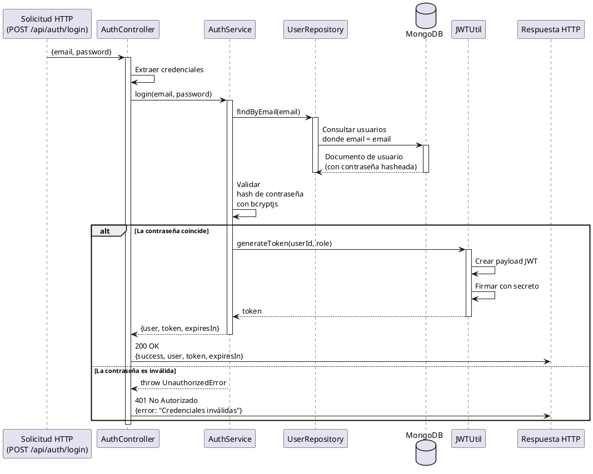
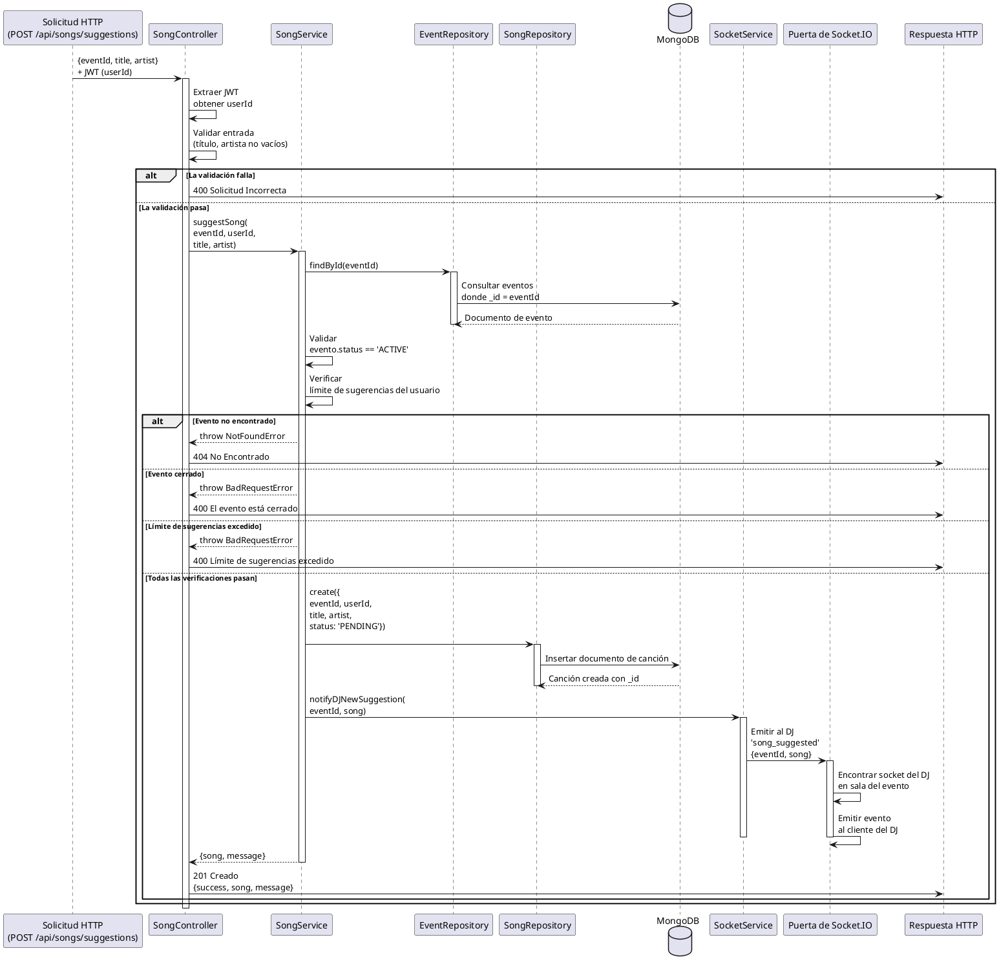
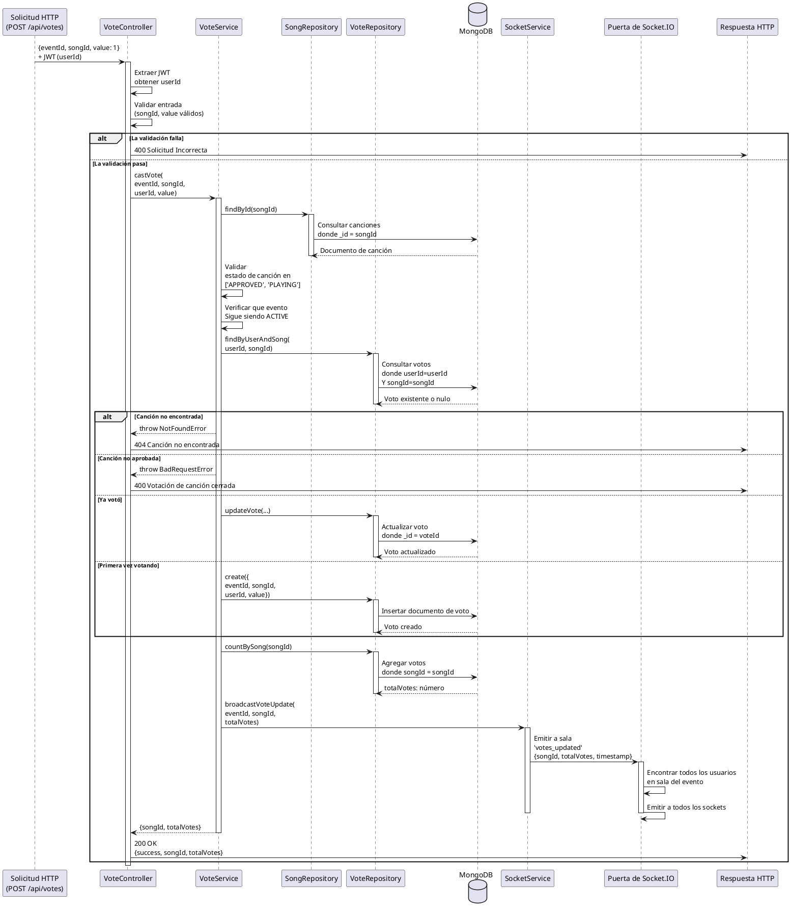
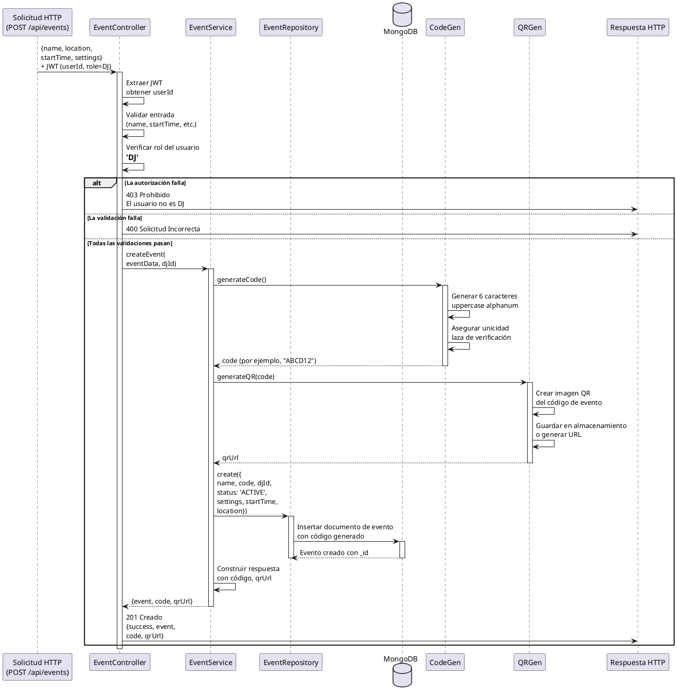
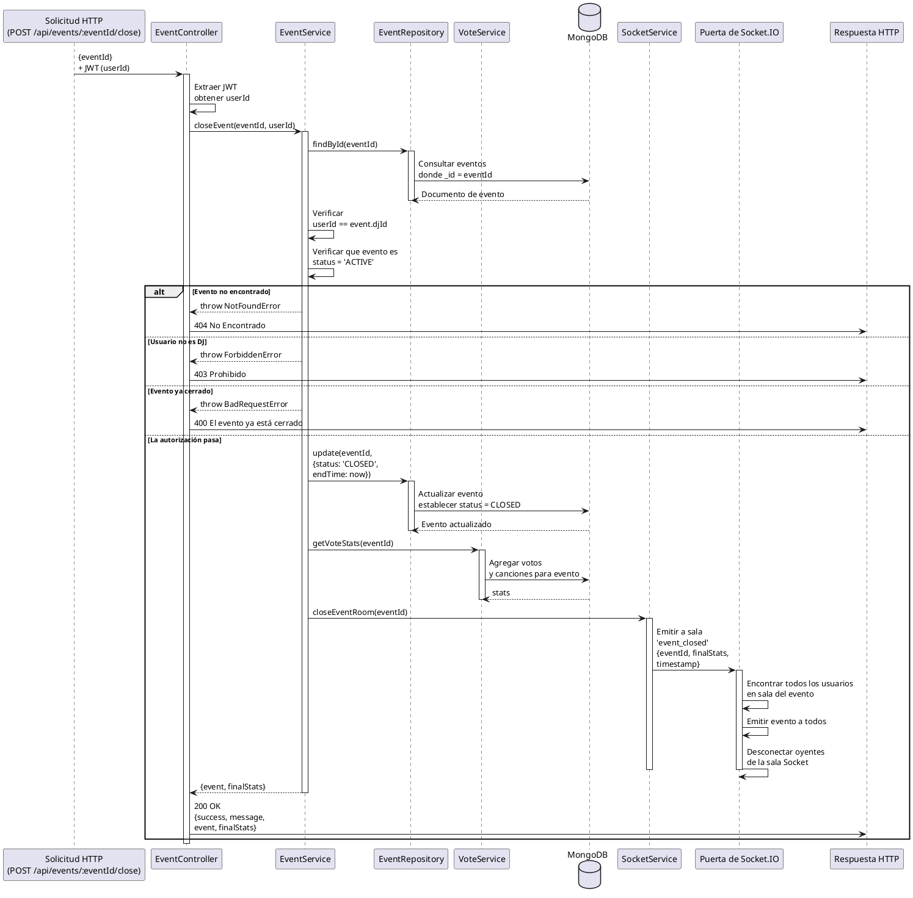
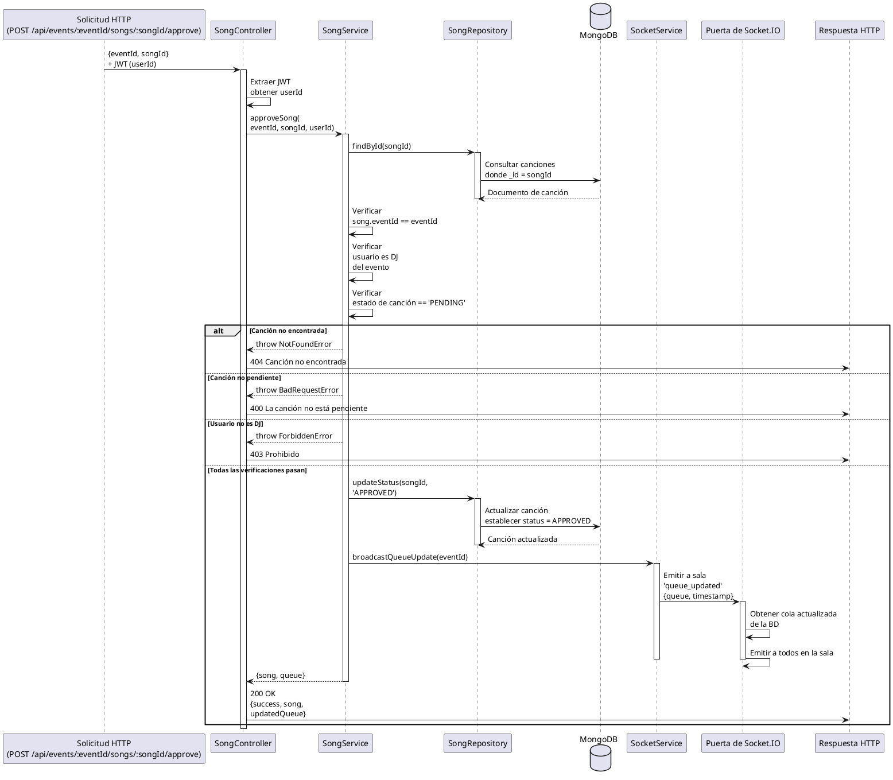
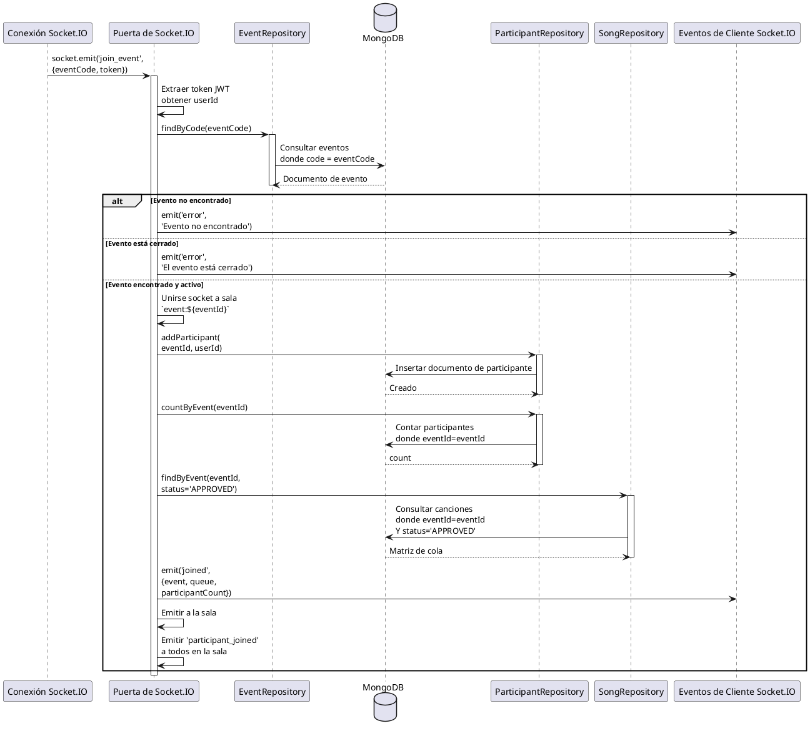

# Diagramas de Secuencia Backend - SyncRekuest

**Enfoque**: Solo lógica interna del servidor (sin mensajes del frontend)

---

## 1. Secuencia de Inicio de Sesión (Perspectiva Backend)

Muestra solo el flujo interno del servidor cuando un usuario se autentica.




### Responsabilidades Backend
Validar que usuario existe
Comparación de hash de contraseña
Generar token JWT
Devolver resultado de autenticación

### Operaciones de Base de Datos
- Consultar usuarios por email
- Sin operaciones de escritura

### Posibles Errores
- Usuario no encontrado (401)
- Contraseña inválida (401)
- Error de base de datos (500)

---

## 2. Secuencia de Sugerir Canción (Perspectiva Backend)

Muestra flujo interno del servidor cuando se sugiere una canción.




### Responsabilidades Backend
Validar que evento existe y está activo
Verificar límite de sugerencias
Crear registro de canción con estado PENDING
Notificar al DJ vía Socket.IO
Devolver canción creada

### Operaciones de Base de Datos
- Consultar evento por ID
- Insertar documento de canción

### Eventos de Socket Emitidos
- `song_suggested` → cliente del DJ

### Posibles Errores
- Evento no encontrado (404)
- Evento está cerrado (400)
- Límite de sugerencias excedido (400)
- Entrada inválida (400)

---

## 3. Secuencia de Voto de Canción (Perspectiva Backend)

Muestra flujo interno del servidor cuando se emite un voto y se emite.




### Responsabilidades Backend
Validar que canción existe y es votable
Verificar si usuario ya votó
Crear o actualizar registro de voto
Calcular votos totales para canción
Emitir a todos los clientes vía Socket.IO
Devolver nuevo conteo de votos

### Operaciones de Base de Datos
- Consultar canción por ID
- Consultar voto existente por usuario + canción
- Insertar nuevo voto O actualizar voto existente
- Agregar votos por canción

### Eventos de Socket Emitidos
- `votes_updated` → Todos los usuarios en sala del evento

### Posibles Errores
- Canción no encontrada (404)
- Votación de canción cerrada (400)
- Valor de voto inválido (400)

---

## 4. Secuencia de Crear Evento (Perspectiva Backend)

Muestra flujo interno del servidor cuando un DJ crea un evento.




### Responsabilidades Backend
Validar JWT y rol de DJ
Validar datos del evento
Generar código único de 6 caracteres
Generar imagen de código QR
Crear registro de evento en base de datos
Devolver evento con código y QR

### Operaciones de Base de Datos
- Insertar documento de evento con código único

### Utilidades Utilizadas
- Generador de código (unicidad garantizada)
- Generador de QR

### Posibles Errores
- Usuario no es DJ (403)
- Entrada inválida (400)
- Generación de código falló (500)
- Generación de QR falló (500)

---

## 5. Secuencia de Cerrar Evento (Perspectiva Backend)

Muestra flujo interno del servidor cuando un DJ cierra un evento.




### Responsabilidades Backend
Verificar JWT y propiedad del DJ
Verificar que evento está activo
Actualizar estado del evento a CLOSED
Calcular estadísticas finales
Emitir event_closed a todos los participantes
Desconectar todos los oyentes Socket.IO

### Operaciones de Base de Datos
- Consultar evento por ID
- Actualizar estado del evento a CLOSED
- Agregar votos y canciones para estadísticas

### Eventos de Socket Emitidos
- `event_closed` → Todos los usuarios en sala del evento

### Posibles Errores
- Evento no encontrado (404)
- Usuario no es DJ (403)
- Evento ya cerrado (400)

---

## 6. Secuencia de Aprobar Canción (Perspectiva Backend)

Muestra DJ aprobando una canción sugerida para la cola.




### Responsabilidades Backend
Verificar propiedad del DJ
Verificar que canción existe y está pendiente
Actualizar estado de canción a APPROVED
Emitir actualización de cola a todos los participantes

### Operaciones de Base de Datos
- Consultar canción por ID
- Actualizar estado de canción

### Eventos de Socket Emitidos
- `queue_updated` → Todos los usuarios en sala del evento

### Posibles Errores
- Canción no encontrada (404)
- Canción no pendiente (400)
- Usuario no es DJ (403)

---

## 7. Secuencia de Aprobar Evento + Unirse a Sala (Perspectiva Backend)

Muestra flujo completo cuando un participante se une a un evento.




### Responsabilidades Backend
Verificar token JWT
Encontrar evento por código
Verificar que evento está activo
Agregar registro de participante
Obtener cola actual
Enviar datos iniciales al usuario que se une
Emitir actualización de conteo de participantes

### Operaciones de Base de Datos
- Consultar evento por código
- Insertar registro de participante
- Contar participantes
- Consultar canciones aprobadas

### Eventos de Socket Emitidos
- `joined` → Usuario que se une
- `participant_joined` → Todos en sala del evento

### Posibles Errores
- Evento no encontrado (error de socket)
- Evento está cerrado (error de socket)
- Token inválido (error de socket)

---

## Resumen: Patrón de Flujo de Solicitud

Todas las secuencias de backend siguen este patrón:

```
1. Solicitud HTTP / Evento de Socket llega
   ↓
2. Middleware: Validar token JWT
   ↓
3. Controller: Extraer y validar entrada
   ↓
4. Service: Ejecutar lógica de negocio
   ↓
5. Repository: Consultar/mutar base de datos
   ↓
6. Service: Calcular respuesta
   ↓
7. SocketService: Emitir actualizaciones si es necesario
   ↓
8. Controller: Devolver respuesta HTTP / Respuesta de Socket
```

---

## Patrones Clave de Backend

Autenticación Basada en JWT - Cada solicitud validada
Patrón de Repository - Abstracción de base de datos
Capa de Service - Lógica de negocio centralizada
Emisión de Socket - Actualizaciones en tiempo real a todos los usuarios conectados
Operaciones Seguras de Transacción - Consistencia de base de datos
Propagación de Errores - Los errores fluyen desde Repository → Service → Controller

---

Este documento se enfoca en **flujos internos de Backend**. Para secuencias de extremo a extremo que incluyen participación del Frontend, consulte `docs/sequence-global_ES.md`.
