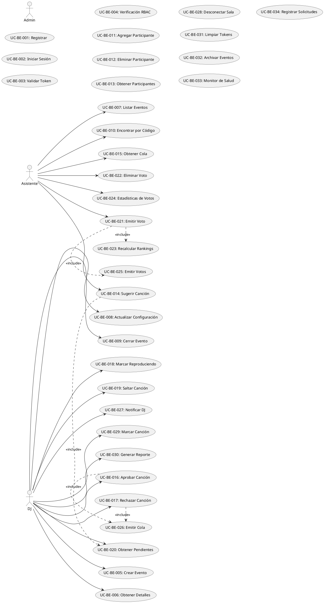

# Casos de Uso Backend - SyncRekuest

**Enfoque**: Operaciones del lado del servidor (sin lógica de UI, sin interacción del frontend)

---

## Lista Completa de Casos de Uso Backend

### Casos de Uso de Autenticación y Autorización

**UC-BE-001: Registro de Usuario**
- Actor: Usuario (vía frontend)
- Precondición: Usuario proporciona email, contraseña, nombre, rol
- Flujo:
  1. Validar formato de email y unicidad
  2. Hash de contraseña con bcryptjs
  3. Crear documento de usuario en MongoDB
  4. Generar token JWT
  5. Devolver token y objeto de usuario
- Postcondición: Nuevo usuario registrado, token emitido
- Base de Datos: INSERT en colección Users

**UC-BE-002: Inicio de Sesión de Usuario**
- Actor: Usuario (vía frontend)
- Precondición: Usuario existe con email registrado
- Flujo:
  1. Consultar usuario por email
  2. Validar hash de contraseña
  3. Generar token JWT con expiración
  4. Devolver token y detalles del usuario
- Postcondición: Usuario autenticado con token
- Base de Datos: Consulta colección Users
- Errores: Credenciales inválidas (401)

**UC-BE-003: Validación de Token**
- Actor: Middleware backend
- Precondición: Token JWT recibido en solicitud
- Flujo:
  1. Extraer token del encabezado Authorization
  2. Verificar firma JWT
  3. Verificar tiempo de expiración
  4. Decodificar payload (userId, rol)
  5. Adjuntar información de usuario a solicitud
- Postcondición: Token validado, solicitud continúa
- Errores: Token inválido (401), Token expirado (401)

**UC-BE-004: Control de Acceso Basado en Roles**
- Actor: Middleware backend
- Precondición: Usuario autenticado con JWT
- Flujo:
  1. Verificar rol de usuario desde token
  2. Verificar si rol tiene permiso para punto final
  3. Permitir o denegar acceso
- Postcondición: Acceso concedido/denegado basado en rol
- Errores: Permisos insuficientes (403)

---

### Casos de Uso de Gestión de Eventos

**UC-BE-005: Crear Evento (DJ)**
- Actor: DJ (vía API REST)
- Precondición: Usuario autenticado, rol = DJ
- Flujo:
  1. Validar datos del evento (nombre, fecha, ubicación)
  2. Generar código único de 6 caracteres
  3. Generar imagen de código QR
  4. Crear documento de evento en MongoDB
  5. Establecer estado a ACTIVE
  6. Emitir evento de socket para notificar DJ
  7. Devolver evento con código y URL de QR
- Postcondición: Evento creado y activo
- Base de Datos: INSERT en colección Events
- Broadcasts: Ninguno (DJ ve respuesta inmediata)
- Errores: Entrada inválida (400), Usuario no es DJ (403)

**UC-BE-006: Recuperar Detalles del Evento**
- Actor: DJ, Asistente
- Precondición: Usuario autenticado, evento existe
- Flujo:
  1. Consultar evento por ID
  2. Validar que usuario tiene acceso
  3. Contar participantes actuales
  4. Calcular estadísticas del evento (votos totales, sugerencias)
  5. Obtener canción principal
  6. Devolver objeto de evento poblado
- Postcondición: Detalles del evento recuperados con estadísticas
- Base de Datos: Consulta Events, agregar Participants y Votes
- Errores: Evento no encontrado (404), No autorizado (403)

**UC-BE-007: Listar Eventos Activos**
- Actor: DJ, Asistente
- Precondición: Usuario autenticado
- Flujo:
  1. Consultar todos los eventos con estado = ACTIVE
  2. Poblar nombre de DJ
  3. Contar participantes para cada uno
  4. Ordenar por startTime o participantCount
  5. Aplicar paginación (por defecto 10 por página)
  6. Devolver lista de eventos
- Postcondición: Lista paginada de eventos activos devuelta
- Base de Datos: Consulta Events, agregar Participants, Unir con Users
- Paginación: Límite por defecto=10, página=1

**UC-BE-008: Actualizar Configuración de Evento**
- Actor: DJ
- Precondición: DJ posee evento, estado del evento = ACTIVE o DRAFT
- Flujo:
  1. Verificar que usuario posee evento (comparar userId con djId)
  2. Validar entrada (máximo de sugerencias, votación habilitada, etc.)
  3. Actualizar documento de evento
  4. Emitir evento de socket a todos los participantes
  5. Devolver evento actualizado
- Postcondición: Configuración del evento cambió, participantes notificados
- Base de Datos: UPDATE colección Events
- Broadcasts: event_settings_changed a sala del evento
- Errores: No autorizado (403), Evento no encontrado (404)

**UC-BE-009: Cerrar Evento**
- Actor: DJ
- Precondición: DJ posee evento, estado del evento = ACTIVE
- Flujo:
  1. Verificar que usuario posee evento
  2. Actualizar estado del evento a CLOSED
  3. Establecer endTime a timestamp actual
  4. Calcular estadísticas finales
     - Total de participantes
     - Total de sugerencias
     - Total de votos
     - Top 3 canciones
  5. Emitir evento event_closed a todos los participantes
  6. Desconectar todos los participantes de la sala del evento
  7. Devolver evento y estadísticas finales
- Postcondición: Evento cerrado, participantes desconectados
- Base de Datos: UPDATE Events, agregar Participants, Votes, Songs
- Broadcasts: event_closed a todos en la sala
- Errores: No autorizado (403), Evento no encontrado (404)

**UC-BE-010: Encontrar Evento por Código**
- Actor: Asistente (vía frontend join)
- Precondición: Asistente tiene código de evento
- Flujo:
  1. Consultar evento por código (insensible a mayúsculas)
  2. Validar que evento existe
  3. Validar que estado del evento = ACTIVE
  4. Devolver objeto de evento
- Postcondición: Evento encontrado y validado
- Base de Datos: Consulta Events por código
- Errores: Evento no encontrado (404), Evento cerrado (400)

---

### Casos de Uso de Gestión de Participantes

**UC-BE-011: Agregar Participante a Evento**
- Actor: Backend (Socket.IO)
- Precondición: Usuario se une a sala del evento
- Flujo:
  1. Verificar token JWT
  2. Consultar evento por ID
  3. Verificar que evento es ACTIVE
  4. Crear registro de participante (joinedAt = ahora)
  5. Actualizar caché de conteo de participantes
  6. Emitir evento participant_joined a la sala
  7. Enviar cola inicial al usuario que se une
  8. Devolver éxito
- Postcondición: Participante agregado, todos notificados
- Base de Datos: INSERT en Participants, QUERY Events y Songs
- Broadcasts: participant_joined a sala del evento
- Socket: Enviar joined event al usuario con datos iniciales

**UC-BE-012: Eliminar Participante del Evento**
- Actor: Backend (Socket.IO)
- Precondición: Usuario abandona evento o desconecta
- Flujo:
  1. Encontrar registro de participante
  2. Establecer leftAt = ahora, active = falso
  3. Decrementar conteo de participantes
  4. Emitir evento participant_left
  5. Verificar si evento debe cerrarse automáticamente (¿sin DJ?)
  6. Devolver éxito
- Postcondición: Participante eliminado, sala notificada
- Base de Datos: UPDATE Participants
- Broadcasts: participant_left a sala
- Errores: Participante no encontrado (404)

**UC-BE-013: Obtener Participantes del Evento**
- Actor: DJ, Asistente
- Precondición: Usuario en evento
- Flujo:
  1. Consultar todos los participantes activos del evento
  2. Unir con colección User para obtener nombres
  3. Devolver lista de participantes con conteo
- Postcondición: Lista de participantes recuperada
- Base de Datos: Consulta Participants, Unir con Users
- Errores: Evento no encontrado (404)

---

### Casos de Uso de Gestión de Canciones

**UC-BE-014: Sugerir Canción (Asistente)**
- Actor: Asistente
- Precondición: Usuario en evento activo, no ha excedido límite
- Flujo:
  1. Validar que evento existe y es ACTIVE
  2. Validar título y artista (no vacíos, límites de longitud)
  3. Verificar conteo de sugerencias del usuario para este evento
  4. Verificar bajo límite maxSuggestionsPerUser
  5. Crear documento de canción con estado = PENDING
  6. Establecer suggestedBy = userId
  7. Emitir evento song_suggested al DJ
  8. Emitir notificación a asistentes (opcional)
  9. Devolver canción creada
- Postcondición: Sugerencia de canción grabada, DJ notificado
- Base de Datos: INSERT en Songs, QUERY Songs para contar
- Broadcasts: song_suggested al DJ, broadcast opcional a todos
- Errores: Evento no encontrado (404), Evento cerrado (400), Límite excedido (400)

**UC-BE-015: Obtener Cola de Evento (Canciones Aprobadas)**
- Actor: Asistente, DJ
- Precondición: Usuario en evento
- Flujo:
  1. Consultar todas las canciones para evento con estado = APPROVED
  2. Para cada canción, contar votos (SUMA de valores de voto)
  3. Poblar nombre de usuario suggestedBy
  4. Ordenar por conteo de votos descendente
  5. Agregar campo position (1, 2, 3, etc.)
  6. Devolver cola poblada
- Postcondición: Cola recuperada y ordenada
- Base de Datos: Consulta Songs, agregar Votes con group y sort
- Paginación: Opcional (enviar todos o limitado)

**UC-BE-016: Aprobar Canción (DJ)**
- Actor: DJ
- Precondición: DJ posee evento, estado de canción = PENDING
- Flujo:
  1. Verificar que usuario posee evento (verificación DJ)
  2. Consultar canción por ID
  3. Verificar que canción pertenece a evento
  4. Verificar que estado de canción = PENDING
  5. Actualizar estado de canción a APPROVED
  6. Establecer approvedAt = ahora
  7. Recalcular ranking de cola
  8. Emitir evento queue_updated a la sala
  9. Emitir notificación a asistentes (canción aprobada)
  10. Devolver canción actualizada y cola
- Postcondición: Canción aprobada, asistentes notificados, cola actualizada
- Base de Datos: UPDATE Songs, agregar Votes
- Broadcasts: queue_updated a la sala
- Errores: No autorizado (403), Canción no encontrada (404), Canción no pendiente (400)

**UC-BE-017: Rechazar Canción (DJ)**
- Actor: DJ
- Precondición: DJ posee evento, estado de canción = PENDING
- Flujo:
  1. Verificar que usuario posee evento
  2. Consultar canción por ID
  3. Verificar que estado de canción = PENDING
  4. Eliminar documento de canción
  5. Emitir notificación song_rejected al asistente que sugirió
  6. Emitir queue_updated a todos (eliminado de pendiente)
  7. Devolver éxito
- Postcondición: Canción rechazada, asistente notificado, eliminado de cola
- Base de Datos: DELETE from Songs
- Broadcasts: queue_updated a la sala
- Errores: No autorizado (403), Canción no encontrada (404)

**UC-BE-018: Marcar Canción como Reproduciendo**
- Actor: DJ
- Precondición: DJ posee evento, estado de canción = APPROVED
- Flujo:
  1. Verificar que usuario posee evento
  2. Consultar canción por ID
  3. Actualizar estado de canción a PLAYING
  4. Actualizar timestamp now_playing
  5. Emitir evento song_status_changed
  6. Emitir notificación (reproduciendo ahora: nombre de canción)
  7. Devolver canción actualizada
- Postcondición: Canción marcada como reproduciendo, todos notificados
- Base de Datos: UPDATE Songs
- Broadcasts: song_status_changed a la sala
- Errores: No autorizado (403), Canción no encontrada (404)

**UC-BE-019: Saltar Canción**
- Actor: DJ
- Precondición: DJ posee evento, estado de canción = PLAYING
- Flujo:
  1. Verificar que usuario posee evento
  2. Consultar canción actualmente reproduciendo
  3. Actualizar estado a SKIPPED
  4. Obtener siguiente canción en cola (siguiente APPROVED por votos)
  5. Actualizar esa canción a PLAYING
  6. Emitir queue_updated y song_status_changed
  7. Devolver nueva canción now_playing
- Postcondición: Canción saltada, siguiente se reproduce
- Base de Datos: UPDATE Songs (múltiples)
- Broadcasts: queue_updated, song_status_changed
- Errores: No autorizado (403)

**UC-BE-020: Obtener Cola de Sugerencias (Moderación DJ)**
- Actor: DJ
- Precondición: DJ posee evento
- Flujo:
  1. Verificar que usuario posee evento
  2. Consultar todas las canciones para evento con estado = PENDING
  3. Ordenar por createdAt ascendente (más antiguo primero)
  4. Poblar nombre de usuario suggestedBy
  5. Devolver canciones pendientes para moderación
- Postcondición: Canciones pendientes recuperadas para revisión del DJ
- Base de Datos: Consulta Songs con estado = PENDING

---

### Casos de Uso de Sistema de Votación

**UC-BE-021: Emitir Voto sobre Canción**
- Actor: Asistente
- Precondición: Estado de canción = APPROVED o PLAYING, usuario en evento
- Flujo:
  1. Validar que evento existe y es ACTIVE
  2. Validar que canción existe y es votable
  3. Consultar si usuario ya votó sobre esta canción
  4. Si no hay voto anterior:
     - Crear documento de voto con valor = 1
     - Contar votos totales para canción
     - Emitir evento votes_updated
  5. Si voto anterior existe:
     - Verificar si es el mismo voto (prevenir duplicado)
     - Permitir solo 1 voto por usuario por canción
     - Emitir votes_updated si cambió
  6. Calcular nuevo conteo de votos
  7. Devolver songId y totalVotes
- Postcondición: Voto grabado, todos los clientes notificados
- Base de Datos: INSERT o SKIP si duplicado, agregar Votes
- Broadcasts: votes_updated a la sala
- Errores: Evento cerrado (400), Canción no encontrada (404), Ya votó (409)

**UC-BE-022: Eliminar Voto**
- Actor: Asistente
- Precondición: Usuario ha votado sobre canción
- Flujo:
  1. Encontrar documento de voto por userId y songId
  2. Eliminar registro de voto
  3. Recalcular total de votos para canción
  4. Emitir evento votes_updated
  5. Devolver éxito y nuevo conteo de votos
- Postcondición: Voto eliminado, todos notificados
- Base de Datos: DELETE from Votes, agregar para contar
- Broadcasts: votes_updated a la sala
- Errores: Voto no encontrado (404)

**UC-BE-023: Recalcular Rankings de Votos**
- Actor: Backend (fondo o bajo demanda)
- Precondición: Evento tiene votos
- Flujo:
  1. Consultar todos los votos para evento
  2. Agrupar votos por canción
  3. Sumar valores de voto por canción
  4. Ordenar canciones por conteo de votos descendente
  5. Actualizar campo position en cada canción
  6. Emitir queue_updated a todos los clientes conectados
  7. Devolver nuevo ranking
- Postcondición: Rankings actualizados, todos los clientes notificados
- Base de Datos: Agregar Votes y Songs, UPDATE posiciones de Songs
- Broadcasts: queue_updated a la sala

**UC-BE-024: Obtener Estadísticas de Votos**
- Actor: DJ, Asistente
- Precondición: Evento tiene votos
- Flujo:
  1. Consultar todos los votos para evento
  2. Calcular:
     - Conteo total de votos
     - Votos promedio por canción
     - Top 3 canciones por votos
     - Tasa de votación (% de participantes que votaron)
  3. Devolver objeto de estadísticas
- Postcondición: Estadísticas de votos recuperadas
- Base de Datos: Agregar Votes y Participants

---

### Casos de Uso de Comunicación en Tiempo Real

**UC-BE-025: Emitir Actualización de Voto**
- Actor: VoteService (disparado por voto)
- Precondición: Voto creado o actualizado
- Flujo:
  1. Calcular nuevo total de votos para canción
  2. Construir evento votes_updated
  3. Emitir a todos los usuarios en sala del evento
  4. Incluir: eventId, songId, totalVotes, timestamp
  5. Manejar usuarios offline con elegancia
- Postcondición: Todos los clientes conectados actualizados en tiempo real
- Socket: Emitir evento votes_updated

**UC-BE-026: Emitir Actualización de Cola**
- Actor: SongService (disparado por aprobar/rechazar/voto)
- Precondición: Cola cambió
- Flujo:
  1. Obtener cola actualizada (todas las canciones aprobadas con conteos de votos)
  2. Ordenar por votos
  3. Construir evento queue_updated
  4. Emitir a todos en la sala
  5. Incluir: eventId, matriz de cola, timestamp
- Postcondición: Todos los clientes ven cola actualizada
- Socket: Emitir evento queue_updated

**UC-BE-027: Notificar al DJ de Nueva Sugerencia**
- Actor: SongService (disparado por sugerencia)
- Precondición: Asistente sugiere canción
- Flujo:
  1. Construir evento song_suggested
  2. Consultar socket del DJ en sala del evento
  3. Emitir al DJ solamente
  4. Incluir: eventId, objeto de canción, suggestedBy, timestamp
  5. DJ recibe notificación
- Postcondición: DJ notificado en tiempo real
- Socket: Emitir song_suggested al socket privado del DJ

**UC-BE-028: Desconectar Sala del Evento**
- Actor: SocketService (disparado al cerrar evento)
- Precondición: Evento se está cerrando
- Flujo:
  1. Obtener todos los sockets en sala del evento
  2. Enviar evento event_closed final
  3. Incluir estadísticas finales
  4. Desconectar forzosamente todos los sockets de la sala
  5. Limpiar oyentes de sala
  6. Registrar limpieza de sala
- Postcondición: Todos los participantes desconectados
- Socket: Emitir event_closed, luego desconectar sala

---

### Casos de Uso de Administración/Moderación

**UC-BE-029: Marcar o Reportar Canción Inapropiada**
- Actor: DJ (moderación opcional)
- Precondición: DJ posee evento, canción existe
- Flujo:
  1. Verificar que usuario posee evento
  2. Crear registro de reporte/marca
  3. Establecer estado de canción a FLAGGED
  4. Opcionalmente eliminar de cola
  5. Registrar incidente para revisión del admin
- Postcondición: Canción marcada, eliminada de cola activa
- Base de Datos: UPDATE Songs, INSERT en Reports
- Futuro: Panel de administración para revisar marcas

**UC-BE-030: Generar Reporte de Evento**
- Actor: DJ
- Precondición: Evento es CLOSED
- Flujo:
  1. Consultar detalles del evento
  2. Contar todos los participantes
  3. Agregar todas las canciones con conteos de votos finales
  4. Calcular estadísticas:
     - Duración
     - Conteo máximo de participantes
     - Canción más popular
     - Total de sugerencias
     - Porcentaje de participación en votación
  5. Generar documento de reporte
  6. Devolver reporte
- Postcondición: Reporte de evento generado
- Base de Datos: Agregar desde Events, Participants, Songs, Votes

---

### Casos de Uso de Operaciones del Sistema

**UC-BE-031: Limpiar Tokens Expirados**
- Actor: Backend (trabajo programado)
- Precondición: Tokens presentes en sistema
- Flujo:
  1. Ejecutar en horario (cada hora o diariamente)
  2. Eliminar tokens de actualización expirados > 7 días
  3. Registrar conteo de limpieza
- Postcondición: Tokens expirados limpios
- Base de Datos: DELETE from RefreshTokens

**UC-BE-032: Archivar Eventos Antiguos**
- Actor: Backend (trabajo programado)
- Precondición: Evento cerrado > 30 días atrás
- Flujo:
  1. Consultar eventos con estado = CLOSED y endTime > 30 días
  2. Crear registro de archivo
  3. Establecer archived = verdadero
  4. Opcional: Eliminar datos asociados
  5. Registrar conteo archivado
- Postcondición: Eventos antiguos archivados
- Base de Datos: UPDATE Events, DELETE opcional

**UC-BE-033: Monitorear Salud de Base de Datos**
- Actor: Backend (servicio de monitoreo)
- Precondición: Sistema en ejecución
- Flujo:
  1. Verificar conexión a MongoDB
  2. Verificar que colecciones críticas existen
  3. Contar documentos en cada colección
  4. Verificar salud del índice
  5. Registrar métricas
  6. Alerta si se detectan problemas
- Postcondición: Estado de salud registrado
- Base de Datos: Consultar metadatos, contar documentos

**UC-BE-034: Registrar Solicitudes de API**
- Actor: Middleware (todas las solicitudes)
- Precondición: Solicitud recibida
- Flujo:
  1. Extraer: método, ruta, usuario, timestamp
  2. Registrar solicitud
  3. Pasar a través del manejo de solicitudes
  4. Registrar respuesta: estado, tiempo
  5. Registrar errores si ocurrieron
- Postcondición: Solicitud registrada
- Registro: Escribir en registros de aplicación

---

## Diagrama de Caso de Uso Backend

---

## Tabla de Resumen

| Caso de Uso | Actor | Disparador | Base de Datos | Eventos Socket |
|----------|-------|---------|----------|---------------|
| UC-BE-005 | DJ | POST /events | INSERT Event | Ninguno |
| UC-BE-014 | Asistente | POST /songs/suggestions | INSERT Song | song_suggested |
| UC-BE-021 | Asistente | POST /votes | INSERT/UPDATE Vote | votes_updated |
| UC-BE-016 | DJ | POST /approve | UPDATE Song | queue_updated |
| UC-BE-009 | DJ | POST /close | UPDATE Event | event_closed |
| UC-BE-011 | Backend | Socket join_event | INSERT Participant | participant_joined |
| UC-BE-025 | Service | En voto | Consulta Votes | votes_updated |

---

## Principios Clave de Backend

Ninguna Lógica de UI - Operaciones puras del servidor
Transacciones de Base de Datos - Consistencia garantizada
Sincronización en Tiempo Real - Socket.IO para actualizaciones instantáneas
Autorización Verificada - Cada operación verifica permiso del usuario
Manejo de Errores - Códigos de estado HTTP apropiados y mensajes de error
Registro y Monitoreo - Pista de auditoría de todas las operaciones

---

**Nota**: Los casos de uso del frontend (UC-FE-001 a UC-FE-032) se documentan en `syncrekuest-frontend/docs-frontend/use-cases-frontend_ES.md`. Los casos de uso globales que cubren flujos completos están en `docs/use-cases-global_ES.md`.
